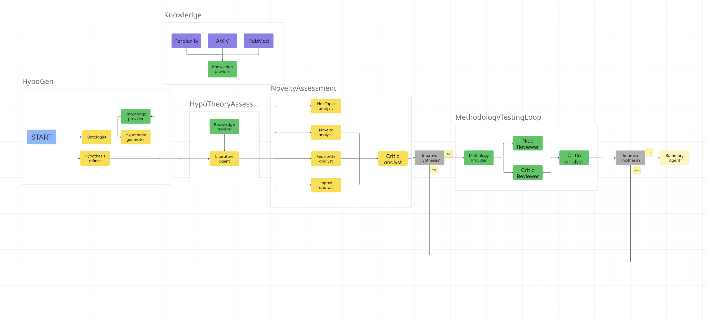

# BeeHealthy
> <span style="font-size: 0.85em; color: #777; "><em>This solution was created during BeeARD hackathon.<em></span>
> 
> 
## Overview

The BeeHealthy workflow is designed to generate hypotheses for a health-related topic using a multi-agent system. The workflow consists of several key components:

> Double-feedback loop as a paradigm shift—moving from linear to adaptive, self-correcting methodology validation.

## Graph



## Agents


```bash
agents
├── critique_analyst.py - Critique Analyst
├── ethic_and_bias_analyst.py - Ethics and Bias Analyst
├── feasibility_analyst.py - Feasibility Analyst
├── hot_topic_reviewer.py - Hot Topic from PubMed
├── hypothesis_generator.py
├── hypothesis_refiner.py - Hypothesis Refiner
├── impact_analyst.py - Impact Analyst
├── literature.py - Literature Review
├── methodology_nice_reviewer.py - Methodology Nice Reviewer
├── methodology_provider.py
├── methodology_review_summary.py - Methodology Review Summary
├── methodology_rude_reviewer.py - Methodology Rude Reviewer
├── novelty_analyst.py - Novelty Analyst
├── novelty_loop.py - Novelty Loop
├── ontologist.py
└── summary.py
```

## Run 

> python -m community_extensions.beehealthy.main -f eval/Autoimmunity.json --output community_extensions/beehealthy/output
